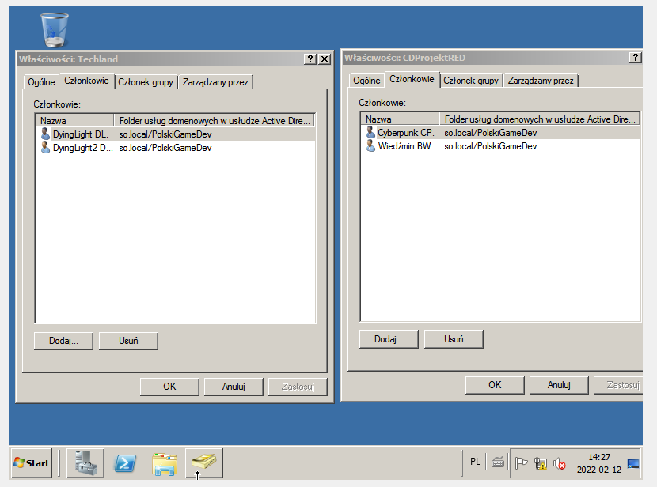
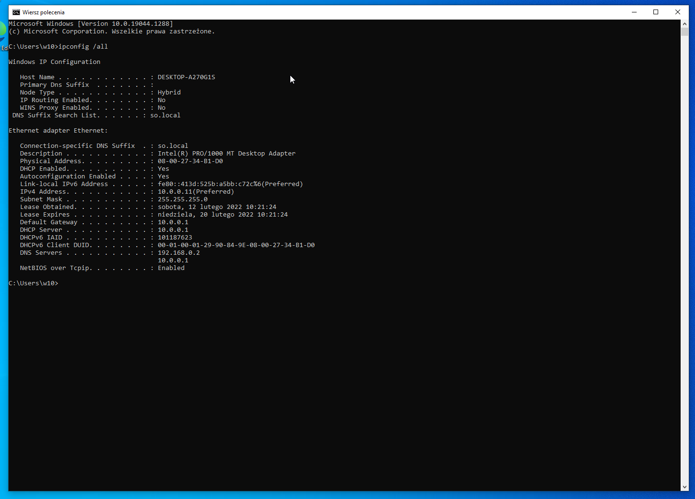

# Windows Server Domain Lab

An academic lab documenting Windows Server installation and a small Active Directory environment. The original tutorials were prepared by **Kacper Lebida** in 2022 using VirtualBox, Windows Server 2012 R2, Windows Server 2008 R2 and a Windows 10 client.

## Scope

- Server VM installation and network adapter configuration.
- Active Directory Domain Services and domain controller configuration.
- DNS and DHCP setup.
- A Windows client receiving its network configuration.
- Organizational units, groups and user accounts.
- A separate exploration of Group Policy settings.

## Documented environment

The tutorial uses a lab domain named `so.local`, a server address of `10.0.0.1`, and a DHCP pool from `10.0.0.11` to `10.0.0.199`, with exclusions for two printers. It describes four users, two groups and one OU.

This records a historical exercise. It is not a recommended production topology or a current deployment guide. Some steps in the source use different adapter modes at different stages; the final topology needs to be reconciled with the original screenshots before publishing runnable instructions.

## My work

The source tutorials bear my name and document the installation and configuration process step by step. This case study highlights the relationship between directory services, name resolution, address allocation and client administration.

## Evidence and verification

The original narrative reports a Windows client receiving a DHCP address and documents user/group membership configuration. A selected group-membership screenshot has been extracted and reviewed. It shows two groups, each containing two lab users in the PolskiGameDev OU under so.local. This is historical evidence, not a freshly reproduced domain join or policy test.

A follow-up reproduction should record:

1. Server/client adapter settings and IP configuration.
2. DNS lookup results and DHCP lease allocation.
3. Domain membership and login with a lab user.
4. OU/group membership and effective policy results.

## Publication preparation

The source includes lab passwords and classroom instructions. They are omitted here. The included screenshot was reviewed; the full tutorials are not redistributed. The GPO document lists many settings, including settings that disable protections; its contents should be treated as policy exploration, not as an approved security baseline.

No VM image, product key, password, customer data or school instruction sheet is included. The next step is to select a small, coherent configuration and reproduce its verification in an isolated lab.

## Original evidence

The source screenshot is dated 12 February 2022. Techland contains Dyinglight and Dyinglight2; CDProjektRED contains Cyberpunk and Wiedźmin. These are fictional lab account names. The image supports the group-membership example, but does not by itself prove effective GPO application or a successful client domain login.

Source: my Windows Server installation and basic roles tutorial. The image is unchanged; the English case study was adapted with Codex assistance on 13 September 2026.

## DHCP client evidence

The original 12 February 2022 output shows DHCP enabled, address 10.0.0.11/24, gateway and DHCP server 10.0.0.1, and the so.local connection suffix. DNS servers are listed as 192.168.0.2 and 10.0.0.1; a future domain-lab reproduction must check that both resolve the AD zone correctly. This screenshot establishes a historical DHCP lease, not a completed domain join.
